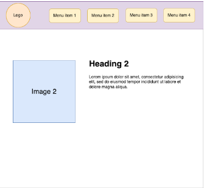
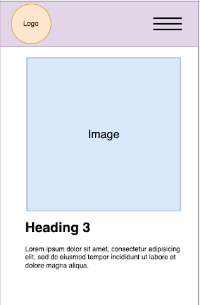
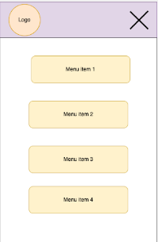

# Завдання:

- Імплепентувати функціональність веб-додатку зі зміною контенту без перезавантаження сторінки.

- При виборі будь-якого з елементів меню повинен змінюватись контент відповідно.

- Зробити мобільну версію (від 360px до 800px) та десктопну версію (від 800px).

[#Demo](https://airdray1.github.io/animoji/)